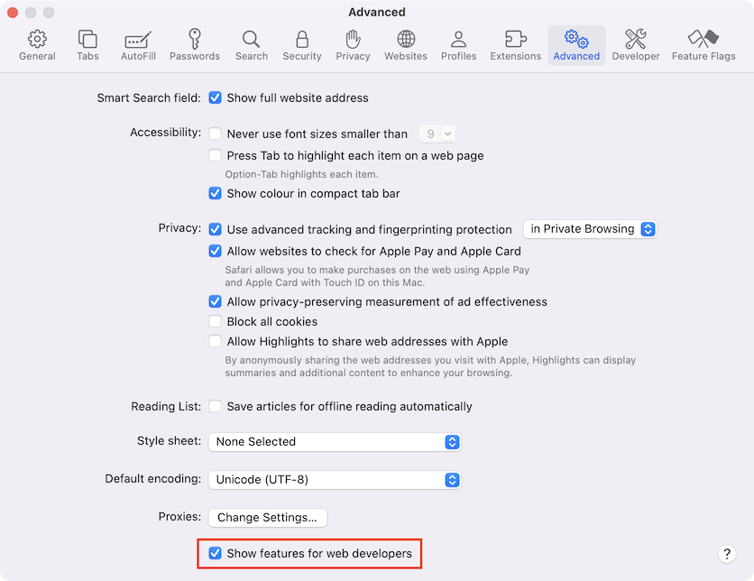

# ئاچقۇچىلار كونسولى (Developer Console)

كودتا ئاسانلا خاتالىق چىقىدۇ.سىزنىڭ خاتالىق پەيدا قىلىش ئېھتىماللىقىڭىز خېلى يۇقىرى، ئاھ، مەن نىمىلەنى جۆيلۈپ كەتتىم؟ مەن دىمەكچى ئەگەر سىز بىر [ماشىنا](https://en.wikipedia.org/wiki/Bender_(Futurama)) ئەمەس بەلكى ئىنسانلا بولسىڭىز **چوقۇم** خاتالىق پەيدا قىلىسىز.

ئەمما تور كۆرگۈچتە بولسا، ئىشلەتكۈچىلەر سۈكۈتتىكى ھالەتتە خاتالىقنى كۆرەلمەيدۇ. شۇڭا، ئەگەر Script تە بىرەر چاتاق چىقسا، نىمىنىڭ خاتا ئىكەنلىكىنى كۆرەلمەيمىز ھەم ئوڭشاپ بولالمايمىز.
خاتالىقلارنى كۆرۈش ۋە Scriptگە مۇناسىۋەتلىك نۇرغۇن پايدىلىق ئۇچۇرلارغا ئېرىشىش ئۈچۈن تور كۆرگۈچلەرگە «ئاچقۇچىلار قوراللىرى» (Developer tools) قىتىۋىتىلگەن.

كۆپىنچە ئاچقۇچىلار Chrome ياكى Firefox دا كودنى ئاچىدۇ ھەم كۆرىدۇ، چۈنكى ئاشۇ تور كۆرگۈچلەر ئەڭ ياخشى ئاچقۇچىلار قوراللىرىغا ئىگە. باشقا تور كۆرگۈچلەرمۇ ئاچقۇچىلار قوراللىرى بىلەن تەمىنلەيدۇ، بەزىدە ھەم باشقا ئالاھىدە ئىقتىدارلىرىمۇ بار، ئەمما ئۇلار ئادەتتە Chrome ياكى Firefox قا ئوخشاش «يامان» بولۇشنى ئويلايدۇ. شۇڭا كۆپىنچە ئاچقۇچىلار ئۆزى «ئەڭ ياخشى كۆرىدىغان» تور كۆرگۈچ بار، ئەمما يولۇققان مەسىلە تور كۆرگۈچكە مۇناسىۋەتلىك بولسا ئامالسىز باشقىلىرىغا ئالماشتۇرىدۇ.

ئاچقۇچىلار قوراللىرى مول؛ ئۇلارنىڭ نۇرغۇن ئىقتىدارلىرى بار. بىز دەسلەپتە ئۇلارنى قانداق ئېچىشنى، خاتالىقلارغا قاراشنى، شۇنداقلا JavaScript بۇيرۇقىنى ئىجرا قىلىشنى ئۆگىنىمىز.

## گوگۇل كىروم تور كۆرگۈچ (Google Chrome) 

ئاۋۋال بۇ [bug.html](bug.html) نى ئاچىمىز.

ئۈستىدە JavaScript كودىدا خاتالىق بار دەپ چىقىدۇ. خاتالىق زىيارەتچىنىڭ كۆزىدىن يوشۇرۇنغان، شۇڭا بىز ئاچقۇچىلار قوراللىرىنى ئېچىپ كۆرۈپ باقايلى.

كۇنۇپكا تاختىسىدا `F12`، ئەگەر مەك كومپىيوتىر بولسا `Cmd+Opt+J` نى باسىمىز.
ئاچقۇچىلار قوراللىرى سۈكۈتتىكى ھالەتتە كونسول بېتىدە ئېچىلىدۇ.
نەتىجىدە ئۈستىدىكى مەزمۇن قارىماققا مۇنداق كۆرۈنىدۇ:


ئاچقۇچىلار قوراللىرىنىڭ كونكرېت قىياپىتى سىزنىڭ Chrome تور كۆرگۈچىڭىزنىڭ نۇسخىسىغا باغلىق. ئۇ پات-پات ئۆزگىرىدۇ، ئەمما ئاساسىي شەكلى ئوخشاش بولىدۇ.
- ؜بۇ يەردە قىزىل رەڭلىك خاتالىق ئۇچۇرىنى كۆرىۋالالايمىز. بۇنداق ئەھۋالدا Script دا نامەلۇم «lalala» دىگەن بۇيرۇق بار.
- ؜ئوڭ تەرەپتە خاتالىق يۈز بەرگەن قۇر نومۇرى بىلەن مەنبەنى چېكىشكە بولىدىغان `bug.html:12` دىگەن ئۇلانما بار.

خاتالىق ئۇچۇرىنىڭ ئاستىدا كۆك رەڭلىك `>` بەلگە بار. ئۇ بىز JavaScript بۇيرۇقىنى يازالايدىغان «بۇيرۇق قۇرى» بەلگىسى. `Enter` كۇنۇپكىسىنى بېسىپ بۇيرۇقنى ئىجرا قىلىشقا بولىدۇ.
ھازىر بىز خاتالىقنى كۆرەلەيمىز، بىز ئۈچۈن ھازىرچە مۇشۇ كۇپايە. كېيىنچە <info:debugging-chrome> دىگەن بابتا  ئاچقۇچىلار قوراللىرىغا قايتىپ بۇ ھەقتە تېخىمۇ چوڭقۇرلاپ ئۈگىنىمىز.

```smart header="كۆپ قۇرلۇق كود"
؜ئادەتتە كونسولنىڭ ئىچىگە بىر قۇر كودنى سېلىپ ،ئاندىن `Enter` كۇنۇپكىسىنى باسساق ئىجرا قىلىدۇ.

؜كۆپ قۇر بۇيرۇق يىزىش ئۈچۈن `Shift+Enter` كۇنۇپكىسىنى باسىمىز. بۇنداق بولغاندا كۆپ قۇرلۇق JavaScript كودىنى كىرگۈزگىلى بولىدۇ.
```


## ؜Edge, Firefox ۋە باشقىلار

باشقا كۆپ قىسىم تور كۆرگۈچلەر `F12` كۇنۇپكىسى ئارقىلىق ئاچقۇچىلار قوراللىرىنى ئاچىدۇ.

ئۇلارنىڭ چىرايى ۋە بىزگە بىردىغان تەسىراتى خېلىلا ئوخشىشىپ كېتىدۇ. بۇ قوراللاردىن بىرىنى قانداق ئىشلىتىشنى بىلسىڭىز (Chrome دىن باشلىسىڭىز بولىدۇ)، باشقىلىرىنىڭ ئاچقۇچىلار قوراللىرىغا ئاسانلا ئالماشتۇرۇپ ئىشلىتىپ كىتەلەيسىز.

## سافارى تور كۆرگۈچ (Safari)

؜Safari (Windows/Linux لار قوللىمايدىغان Mac تور كۆرگۈچى) بۇ يەردە سەل ئالاھىدە. بىز ئاۋۋال «ئاچقۇچى تىزىملىكى» (Developer menu) نى قوزغىتىشىمىز كېرەك.
تەڭشەكنى ئاچىمىز ۋە «ئىلغار» (Advanced) نى چىكىمىز. ئاستى تەرەپتە بىر توغرا بەلگىسى قويىدىغان تاللاش تەڭشىكى بار:



ئەمدى `Cmd+Opt+C` كۇنۇپكىسىنى بىسىپ كونسولنى ئېچىشقا بولىدۇ. دىققەت قىلساق شۇنى بايقايمىزكى ئەمدى «ئاچقۇچى» (Developer) دىگەن يېڭى بىر تىزىملىك تۈرى پەيدا بولدى. ئۇنىڭدا نۇرغۇن بۇيرۇق ۋە تاللاشلار بار.

## خۇلاسە

- ؜ئاچقۇچىلار قوراللىرى بىزنى خاتالىقلارنى كۆرۈش، بۇيرۇق ئىجرا قىلىش، ئۆزگەرگۈچى مىقدارلارنى تەكشۈرۈش قاتارلىق ئىشلارغا يول قويىدۇ.
- ؜Windows دىكى كۆپ قىسىم تور كۆرگۈچلەر ئۈچۈن `F12` كۇنۇپكىسى ئارقىلىق ئاچقىلى بولىدۇ. Mac تىكى Chrome دا `Cmd+Opt+J` نى، Safari دا `Cmd+Opt+C` (يۇقىردا دەپ ئۆتكەندەك ئاۋۋال قوزغىتىش كېرەك) نى بىسىپ ئاچىمىز.

ئەمدى مۇھىت تەييارلىقى پۈتتى. كېيىنكى قىسىمدىن باشلاپ JavaScript نىڭ ئۆزىنى ئۈگىنىشكە چۈشىمىز.
